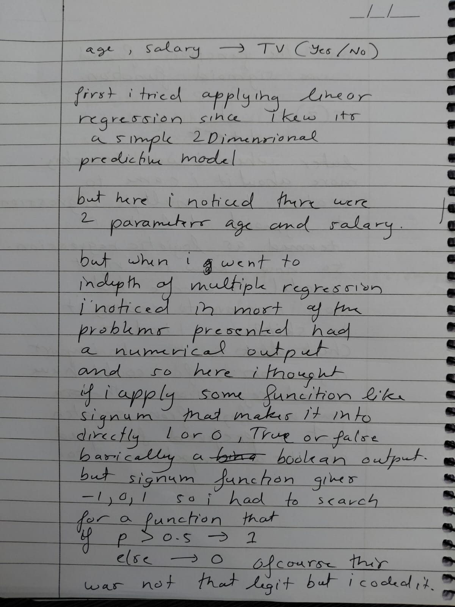
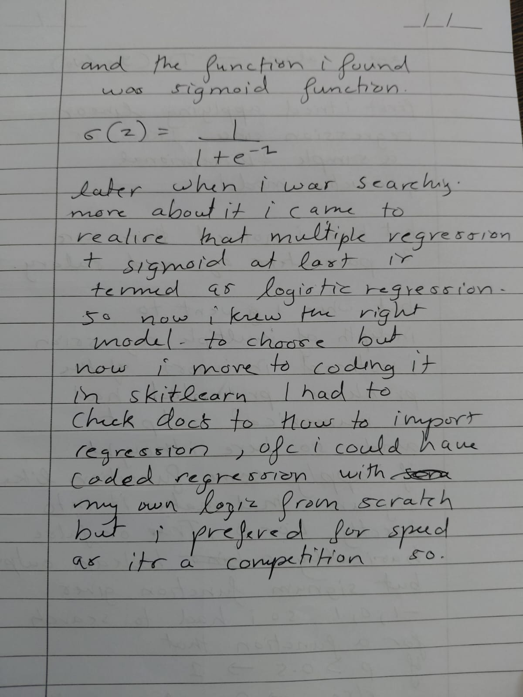
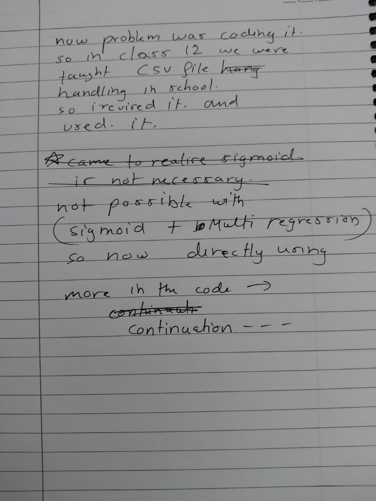

# Customer Decision Analysis model trained using logistics regression 

## Modules used : scikit-learn , csv 
## Model used : Logistic regression 
## dataset used : given by the event host -> dataset.csv
## final code filename : finalcleanpredictor.py
## language used : python

## modules to be installed using : `pip install scikit-learn`

### I have included 2 extra codes where in one i've just experimentally revised the data handling using csv and the another is where ive shows my actual thought process using excessive live comments in the code itself
### I have also included 3 pictures of very initial thought process of how i came upon the decision of using this particular model and not any other regression or ml model.

# thought process images:

